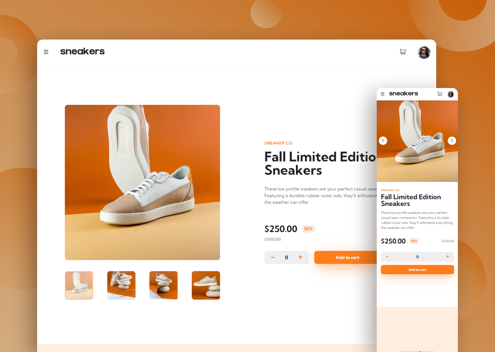

  

    <h1>Sneakers</h1>
     
    
A modern and responsive product page for a sneakers store

    <h3><a href="https://sneakers-cem.netlify.app/">🔗 Link to the Website</a></h2>
    
  

## Built with

## Features

- Interaction to increase or decrease the number of product
- Add the product to the cart / Delete the product from the cart
- Carousel Component built with SwiperJS library
- Sass with BEM Methodology
- Responsive and modern Website

## Context of the Project

- The goal was to use my JS & Sass skills to built a webpage on my own
- The design of the webpage come from <a href="https://frontendmentor.io/">Front-End Mentor</a>
